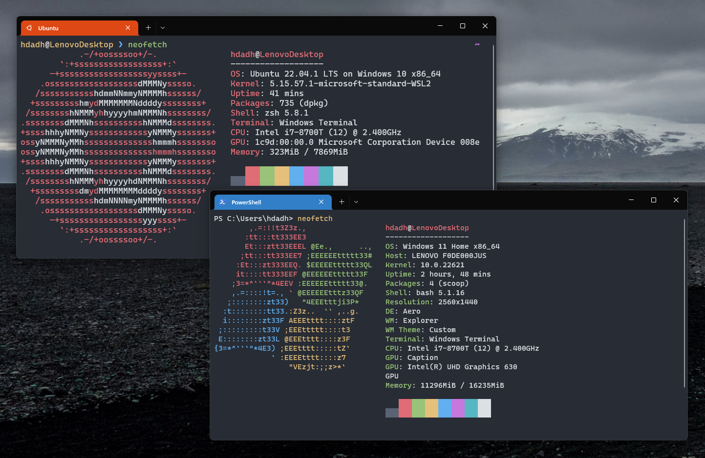

# 📜 Windows Terminal Tutorial
Learn how to set up a **clean, minimal, and efficient** terminal geared towards **Python development**. This tutorial assumes a [Windows 10](https://www.microsoft.com/en-us/windows/get-windows-10)/[11](https://www.microsoft.com/en-us/windows/get-windows-11) (preferably with the latest update) and a [Visual Studio Code](https://code.visualstudio.com/) installation.



- [📜 Windows Terminal Tutorial](#-windows-terminal-tutorial)
  - [⌨️ Visual Studio Code](#️-visual-studio-code)
  - [🪟 WSL](#-wsl)
    - [⤵️ Install](#️-install)
    - [💡 Enable](#-enable)
  - [🐧 Ubuntu](#-ubuntu)
    - [⤵️ Install](#️-install-1)
  - [▶️ Terminal](#️-terminal)
    - [🏃 Setup](#-setup)
    - [⚙️ Configuration](#️-configuration)
      - [📜 zsh](#-zsh)
      - [🐍 Python](#-python)
      - [📦 PDM](#-pdm)
    - [📄 Neofetch](#-neofetch)
  - [👁️‍🗨️ Information](#️️-information)
    - [📂 Ubuntu File System](#-ubuntu-file-system)
    - [🎨 Change zsh Theme](#-change-zsh-theme)
    - [🔧 More Tools](#-more-tools)
      - [🎥 asciinema](#-asciinema)
      - [🤖 pipreqs](#-pipreqs)
      - [🚧 pre-commit](#-pre-commit)
      - [🖊️ GPG](#️-gpg)
      - [🕛 WakaTime](#-wakatime)
  - [🏁 Finish](#-finish)
    - [⚠️ Errors](#️-errors)

## ⌨️ Visual Studio Code
We will be [Visual Studio Code](https://code.visualstudio.com/), the most popular code editor out today, along with some extensions:
* [Remote - WSL](https://marketplace.visualstudio.com/items?itemName=ms-vscode-remote.remote-wsl) - Virtual environment integration with WSL
* [Python](https://marketplace.visualstudio.com/items?itemName=ms-python.python) - Support extension for the Python language

## 🪟 WSL
As per the official Microsoft description, "The Windows Subsystem for Linux lets developers run a GNU/Linux environment." Put into simple terms, you can use a Linux environment without waiting an hour for your dual-boot or VM configuration to load or risk your entire drive trying to partition it. Still confused? Check out [this video](https://www.youtube.com/watch?v=-atblwgc63E).

### ⤵️ Install
We'll be using version `2` since it's supposedly faster. You can check out the official Microsoft Comparison [here](https://docs.microsoft.com/en-us/windows/wsl/compare-versions). Install and configure with:
```pwsh
wsl --install
wsl --set-default-version 2
```

### 💡 Enable
A simple installation isn't enough, so you'll need to enable a feature to use WSL.
- Navigate to `Task Manager` through <kbd>🪟</kbd> or with <kbd>Ctrl</kbd>+<kbd>Shift</kbd>+<kbd>Esc</kbd>.
  -  Make sure `Virtualization` is enabled in the `CPU` section of your task manager's `Performance` page
- Navigate to `Turn Windows features on or off` through the Windows search bar
- Enable `Windows Subsystem for Linux` if it isn't already

Now go ahead and reboot your computer. Relax, it's the only time you'll ever have to.

## 🐧 Ubuntu
The most popular and beginner-friendly Linux distribution out there, Ubuntu has collaborated with Microsoft to make WSL possible. This is the Linux distribution that we'll be running atop WSL.

### ⤵️ Install
Nothing crazy on this one, just install Ubuntu from the [Microsoft Store](https://apps.microsoft.com/store/detail/ubuntu/9PDXGNCFSCZV). Once finished, enter Ubuntu through the <kbd>🪟</kbd>, and it'll bring up a window and start installing the distribution.

Once finished, launch the app and run its installation course. Then you'll be prompted to enter a username, which you can just set to your Windows username, or whatever you like. Same goes for your password, although it's advisable to keep this the same as your Windows password so you don't have to reach for a sticky note or use your brain every time. Your **keyboard won't output** to the screen while you type out your password, as this is an intentional feature to keep your credentials secure.

⚠️ If you can't type out a username, or it's automatically set as `root`, run the following commands in PowerShell (retrieved from [issue](https://github.com/microsoft/WSL/issues/8736)) to briefly reinstall and re-enter a username.
```pwsh
wsl --unregister Ubuntu
ubuntu install --ui=none
```

## ▶️ Terminal
Now you can exit out of that bland default Ubuntu terminal. Go ahead and open up Windows Terminal through <kbd>🪟</kbd>, and pin it to your taskbar. You may have to install it from the [Microsoft Store](https://apps.microsoft.com/store/detail/windows-terminal/9N0DX20HK701) due to what version you're on (specific releases of Windows 10 don't come with it).

### 🏃 Setup
Since we don't want PowerShell and the generic color scheme opening up by default, we're going to change it up.
* Click the dropdown by the `+` symbol and go to `Settings` (or with <kbd>Ctrl</kbd>+<kbd>,</kbd>)
* In the `Startup` tab
  * Change your `Default profile` to `Ubuntu` (with the orange logo)
  * Make sure you hit `Save` on the bottom right (easy to forget)
* In the `Defaults` > `Appearance` tab
  * Set your `Color Scheme` to `One Half Dark`
  * Set your `Background opacity` to `50%`
  * Set your `Enable acrylic material` to `on`
  * Again, make sure you hit `Save`
  * Modify however else you desire

Now you can exit out of the entire thing, and re-open it to something that hopefully doesn't look like it belongs to a systems engineer that spends his vacation in the company's server room.

### ⚙️ Configuration
Now for the most technical part of the guide, we'll set up your terminal to mimic that of a professional. I'll try my best to explain what the hell the commands you are punching in do.

Don't worry, you're not touching with any Windows system files here. If you mess up, you can go to `Add or remove programs` through your Windows search bar, search for `Ubuntu` and click `⋮` > `Advanced options` > `Reset`.

#### 📜 zsh
We'll install everything involving the look and functionality of your terminal. Starting off, we'll upgrade everything. It'll ask for your password because we are running it with `sudo`, which means "super user do." The `-y` flag answers `yes` to all `Y/n` prompts.
```bash
sudo apt update && sudo apt upgrade -y
```
`update` just retrieves new versions of updatable packages, `upgrade` actually upgrades them. This command could take a while, so go make a cup of coffee.

Now we'll install `zsh` (a shell built on bash, the Ubuntu default) and `oh-my-zsh` (a customization framework for `zsh`). **Don't forget to indicate `yes` when it prompts you to make zsh your default shell.**
```bash
sudo apt install zsh -y
sh -c "$(curl -fsSL https://raw.github.com/ohmyzsh/ohmyzsh/master/tools/install.sh)"
```
Now we'll install our theme. This is separate from what we did back on Windows Terminal settings because we are modifying how the terminal actually displays informational text. The theme we are installing is called [Typwritten](https://github.com/reobin/typewritten) and is a "minimal zsh prompt" as per its author. Learn how to install a different theme of your liking [here](#-change-zsh-theme).

The first command is retrieving the theme from its repository and the following two commands set up symbolic links for it. Following that, we're "echoing" some settings to preserve our block cursor and add our `user@host` prefix into our `.zshrc` file, which is run every time you pop up a new session.
```bash
git clone https://github.com/reobin/typewritten.git $ZSH_CUSTOM/themes/typewritten
ln -s "$ZSH_CUSTOM/themes/typewritten/typewritten.zsh-theme" "$ZSH_CUSTOM/themes/typewritten.zsh-theme"
ln -s "$ZSH_CUSTOM/themes/typewritten/async.zsh" "$ZSH_CUSTOM/themes/async"
echo 'TYPEWRITTEN_CURSOR="block"' >> ~/.zshrc
echo 'TYPEWRITTEN_PROMPT_LAYOUT="singleline_verbose"' >> ~/.zshrc
```
Now we'll install some plugins, stuff that'll make your life easier. Everything except the `echo` and last command fetches a plugin. The statement we "echoed" into `.zshrc` sets an alias as `bat` for the plugin's default command, `batcat`. The last one installs tools for [VS Code](#️-visual-studio-code) and opens up a file called `.zshrc`.
```bash
sudo apt install bat -y
echo "alias bat=/usr/bin/batcat" >> ~/.zshrc
sudo apt install tig
git clone https://github.com/zsh-users/zsh-autosuggestions ${ZSH_CUSTOM:-~/.oh-my-zsh/custom}/plugins/zsh-autosuggestions
git clone https://github.com/zsh-users/zsh-syntax-highlighting.git ${ZSH_CUSTOM:-~/.oh-my-zsh/custom}/plugins/zsh-syntax-highlighting
git clone https://github.com/agkozak/zsh-z ${ZSH_CUSTOM:-~/.oh-my-zsh/custom}/plugins/zsh-z
code ~/.zshrc
```
To make our theme and plugins work, we will need to add them to our `.zshrc` file so our shell uses them for every new session. Hit <kbd>Ctrl</kbd>+<kbd>F</kbd> and find `ZSH_THEME` to change it to:
```
ZSH_THEME="typewritten"
```
Hit <kbd>Ctrl</kbd>+<kbd>F</kbd>, find `=(g`, and change it to:
```
plugins=(copybuffer copypath copyfile dirhistory git jsontools tig web-search zsh-autosuggestions zsh-syntax-highlighting zsh-z)
```
The reason we have more plugins in addition to the ones we installed is because `oh-my-zsh` comes with some default ones, which we are simply enabling. You can browse the functionalities of these plugins through these resources: [Article](https://safjan.com/top-popular-zsh-plugins-on-github-2021/) | [Masterlist](https://github.com/unixorn/awesome-zsh-plugins) | [Wiki](https://github.com/ohmyzsh/ohmyzsh/wiki/Plugins)

Once you've saved `.zshrc` and exited the window, you can load your changes with:
```bash
source ~/.zshrc
```
#### 🐍 Python
Now you have a nice looking terminal, but you actually need language-specific tools. The latest version of Ubuntu on the Windows Store includes Python `3.10`. You can make sure by running `python3 -V`. If you have a different version, check out [this article](https://cloudbytes.dev/snippets/upgrade-python-to-latest-version-on-ubuntu-linux) for instructions on how to upgrade. To install and manage project dependencies like any normal developer, you'll need package managing tools. Install `pip` and `venv` with:
```bash
sudo apt install python3-pip -y
sudo apt install python3.10-venv -y
```
You can make sure you have correctly installed `pip` by running `pip -V`. Currently, the only way to run Python is by typing out `python3`, which can get a bit tedious, so let's minimize this and reload your session with:
```bash
sudo apt install python-is-python3
echo "alias py=/usr/bin/python3" >> ~/.zshrc
source ~/.zshrc
```
Run `python` to make sure you can enter the REPL. Run `exit()` to hop out. Repeat this with `py`.

#### 📦 PDM
We installed `venv` in the previous section, so you could just run the following for the standard virtual environment setup inside your project directory.
```bash
python -m venv venv
source venv/bin/activate
```
However this directory will grow larger with your project over time. Each virtual environment can take up a lot of space with just the base install.

Enter [PDM](https://pdm.fming.dev/latest/), a package manager that takes advantage of [`PEP 582`](https://peps.python.org/pep-0582/) which allows Python to automatically recognize a `__pypackages__` folder in your project directory. You can skip having to activate a virtual environment every time and run your project directly. In the background, Python uses the same global interpreter and imports packages from each project's `__pypackages__` folder. This enhancement is still pretty new, available in versions `3.8` and up. PDM also offers many more features to use in coalition with this feature with a great user interface.

If you're down to try it out, install PDM and configure PEP 582 mode with:
```bash
curl -sSL https://raw.githubusercontent.com/pdm-project/pdm/main/install-pdm.py | python3 -
echo "export PATH=/home/$USER/.local/bin:\$PATH" >> ~/.zshrc && source ~/.zshrc
pdm --pep582 >> ~/.zshrc && source ~/.zshrc
```
[VS Code's](#️-visual-studio-code) Python extensions include linting tools that will display an error for imported packages they cannot find. This will happen because they currently don't look inside your `__pypackages__` directory. [`pdm-vscode`](https://github.com/frostming/pdm-vscode) fixes this issue by generating a `settings.json` file in your workspace to point your Python extensions to your project's dependencies within PEP 582 mode. Install the plugin with:
```bash
pdm plugin add pdm-vscode
```
You can check out other `pdm` plugins you might want in your development environment [here](https://github.com/pdm-project/awesome-pdm). Also, I recommend these resources to jump into using `pdm`: [Documentation](https://pdm.fming.dev/latest/) | [Short](https://youtu.be/nHHB55QKu6g) | [Long](https://youtu.be/qOIWNSTYfcc)


### 📄 Neofetch
Installing a Linux distribution without Neofetch is something unheard of. To pull up some ASCII art and system information, install it with:
```bash
sudo apt install neofetch -y
exec zsh
neofetch
```
You can also install Neofetch on Windows through a PowerShell terminal with:
```pwsh
iwr -useb get.scoop.sh | iex
scoop install neofetch
scoop install git
neofetch
```

## 👁️‍🗨️ Information
### 📂 Ubuntu File System
Ubuntu has its own special file system, you can explore it [here](https://en.wikipedia.org/wiki/Filesystem_Hierarchy_Standard).
* `cd`/`cd ~` will take you to `/home/$USER` directory
  * This is the default landing directory for every new session
* `cd /` will take you to your root or `/` directory
* `cd /mnt` will take you to your Windows file system
  * ex: `cd /mnt/c/Users/$USER/Desktop` = `C:\Users\$USER\Desktop`'
* `pwd` will list the directory you are currently in

Run `cd && mkdir dev` make a `dev` folder in your landing directory. Store your projects within this folder so you can easily access them whenever you open up a new session. It is recommended to have your projects stored here inside the Ubuntu file system as opposed to your Windows file system for faster performance and avoiding errors during package installation.

### 🎨 Change zsh Theme
If you didn't like the theme used in this guide, you can modify it for another look.
* Modify current ([typewritten](https://typewritten.dev/)) theme
  * Use the instructions on the theme's website to modify your prompt, color, etc.
* Use a theme from the [internal library](https://github.com/ohmyzsh/ohmyzsh/wiki/Themes)
  * Run `code ~/.zshrc` > set `ZSH_THEME` to new theme > save, exit, and `source ~/.zshrc`
* Use a theme from the [external library](https://github.com/ohmyzsh/ohmyzsh/wiki/External-themes)
  * Install using the `oh-my-zsh` or `Ubuntu/Manual` instructions
  * Run `code ~/.zshrc` > modify `ZSH_THEME` > save, exit, and run `source ~/.zshrc`

### 🔧 More Tools
#### 🎥 asciinema
Sometimes you want to layout the complete history of the commands you punched in to your terminal. Setting up a screen recording software or making lengthy logs is inefficient. Instead, you can use [asciinema](https://asciinema.org/) to quickly record and upload sessions. Make an account on their website and install it with:
```bash
sudo apt-add-repository ppa:zanchey/asciinema -y
sudo apt-get update
sudo apt-get install asciinema
```
Start recording with:
```bash
asciinema rec
```
and stop with:
```
exit
```
You can save recordings to your created account with:
```bash
asciinema auth
```

#### 🤖 pipreqs
Sometimes you will start programming away, and when you finally reach the point of wanting to test it, you have to manually build your `requirements.txt` file with each package you import in your project. [`pipreqs`](https://github.com/bndr/pipreqs) will automatically go through your project directory files and fetch every imported module. Install it with:
```bash
pip install pipreqs
```
You can view the full [documentation](https://github.com/bndr/pipreqs) to add specific flags to suit your needs. Unfortunately, this module will generally import modules already present in the dependency lists of other modules. However, it's easier to delete/modify those than manually adding your packages.

#### 🚧 pre-commit
Having to format your code manually by running commands every time before committing is pretty annoying. Install `pre-commit`(https://pre-commit.com/) globally with:
```bash
pip install pre-commit
```
Now obviously you wouldn't want it to run on every single project you are working on. This is why you have to run the following in your project's directory. This project should already be initialized with git, which means it contains a `.git` folder. This installs a "hook," or an action, that will run every time you attempt to commit. Hence the name, pre-commit. Enable it in your project with:
```bash
pre-commit install
```
Now you can start integrating some [hooks](https://pre-commit.com/hooks.html) you want to use into a `.pre-commit-config.yaml` file that will executed before you commit. Check out the one for this repository [here](https://github.com/hdadhich01/terminal/blob/main/.pre-commit-config.yaml). If you want contributors for your project, you should check out [pre-commit ci](https://pre-commit.ci/). This basically has the same functionality except that your contributors don't have to care about any of this stuff because it's all handled by the CI server. Check out its usage in this [simple project](https://github.com/hdadhich01/round-nutrition) denoted by the green checkmark on the file listing's header.

#### 🖊️ GPG
GPG is an encryption tool that comes packaged with Ubuntu. It can help you get verify your commits to ensure that every modification comes from you. Also, it looks more professional when committing to reasonably sized community projects. Configure it for use with:
```bash
echo "export GPG_TTY=$(tty)" >> ~/.zshrc
source ~/.zshrc
```
Generate a key with:
```bash
gpg --full-generate-key
```
Make sure you enter `1`, `4096`, `0`, and `y` for the prompts, respectively. Specify your name and email address to match that of your GitHub account. Once generated, copy the key string between the square brackets:
```
gpg: key [COPY THIS] marked as ultimately trusted
```
Add your key to `git` and enable commit signing with:
```
git config --global user.signingkey COPIED_KEY
git config --global commit.gpgsign true
```
To integrate this with source control in [VS Code](#️-visual-studio-code), turn on `Git: Enable Commit Signing` in `User` settings. Now, GitHub just needs a way to verify that it is actually you committing to a repository, which means you will give it the key you generated so it can check it against every commit's signature. Get the full key with:
```bash
gpg --armor --export COPIED_KEY
```
Now save it to GitHub [here](https://github.com/settings/keys) by hitting `New GPG key` and pasting it into the `Key` field. The name can be set as anything, but preferably go for your device's name (ex: `Lenovo Laptop`). Now when you attempt to commit, you will be prompted for the passphrase that you encrypted your key with. Once its through, you will see a green `Verified` box next to every single commit you make on GitHub.

#### 🕛 WakaTime
Tracking how much time you are spending on your projects each day helps you develop a sense of priority and consistency. Head over to [WakaTime](https://wakatime.com/) to set up an account.

As per the tools we used in this guide, you can set it up for [VS Code](https://wakatime.com/vs-code) and [zsh](https://wakatime.com/terminal). If you've got other editors, check out [this page](https://wakatime.com/plugins) to install their plugin(s). Their instructions are pretty straightforward.

## 🏁 Finish
Upgrade everything and force reboot your distribution.
```bash
sudo apt update && sudo apt upgrade
sudo reboot -f
```
You're good to go, welcome to your new development environment.

### ⚠️ Errors
You might run into an error where you might have restarted your computer and open up your terminal to see the following layout, wondering where your original layout went. This is the WSL GUI interface, an addition to only WSL2 enabling you to run native Linux apps. If you're interested, check out its functionality [here](https://youtu.be/b1YBx1L8op4).
```
wslg [ ~ ]$
```
To fix this, open up a PowerShell terminal and run:
```pwsh
wsl --shutdown
wsl
```
Now you can relaunch your session to restore your original layout.
